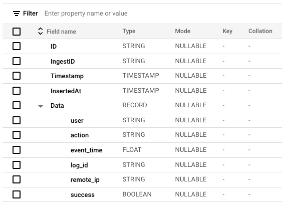
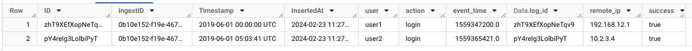

# swarm

A tool to ingest log data with a dynamic schema from Google Cloud Storage into BigQuery.


## Features

- Cloud Storage からオブジェクトを取得し、BigQuery にデータを投入する
- Pub/Sub を経由して Cloud Storage からオブジェクト保存などのイベントを取得し、そのオブジェクトをリアルタイムに取り込む
- オブジェクトのスキーマを自動検出し、BigQuery にテーブルを作成、あるいはスキーマを更新する
- Regoによってデータの取り込み方法の決定や、レコードごとの保存するデータの修正や、保存先の決定を制御できる
- (To be implemented) Cloud Storage のバケットに保存されたオブジェクトをすべて読み込み、BigQueryのテーブルを再構築する

## Getting Started

手始めに、ローカル環境から実行してみましょう。実際のデプロイについてはは[Deployment](docs/deployment.md)を参照してください。本来 Swarm はPub/Sub経由でCloud Storageからオブジェクト生成などのイベントを受けて処理をするものですが、今回はすでにCloud Storage上にあるオブジェクトを直接指定し、BigQueryに投入するというコマンドを実行します。

### Prerequisites

- Go 1.22 or later
- Google Cloudのプロジェクト（例: `my-project`）
- Cloud Storage に保存されたログファイルのオブジェクト (例: `gs://swarm-test-bucket/test.log`)
- ログ投入先の BigQuery データセット (例: `my_dataset`)
- Cloud Storageのオブジェクトの読み込み権限、およびBigQueryへのデータ投入権限を持ったアカウント
    1. [gcloud](https://cloud.google.com/sdk/gcloud)コマンドにより権限のあるユーザが認証している
    2. Service Accountおよびそのキーファイルを作成し、環境変数 `GOOGLE_APPLICATION_CREDENTIALS` にそのファイルパスを設定する

### Installation

```bash
go install github.com/m-mizutani/swarm@latest
```

### Create rule files

`swarm` は[Rego](https://www.openpolicyagent.org/docs/latest/policy-language/)言語を使用してルールを記述することができます。最低限、 "Event rule" と "Schema rule" を記述する必要があります。詳しくは[Rule](./docs/rule.md)を参照してください。まずは以下のようなファイルを作成してください。

**policy/event.rego**
このファイルは、Cloud Storage に保存されたオブジェクトを読み取るためのルールを記述します。以下のルールではJSON形式でログが保存されており、`my_schema` という名前のSchema Ruleを使用することが指定されています。

```rego
package event

src[s] {
  input.kind == "storage#object"
  input.bucket == "swarm-test-bucket"
  s := {
    "parser": "json",
    "schema": "my_schema",
  }
}
```

**policy/schema.rego**
このファイルはオブジェクトをパースした結果得られたレコードをどのように処理するべきかを記述します。

```rego
package schema.my_log

log[d] {
    d := {
        "dataset": "my_dataset",
        "table": "my_log_table",

        "id": input.log_id,
        "timestamp": input.event_time,
        "data": input,
    }
}
```

### Execution

ルールの準備ができたら以下のようにコマンドを実行します。

```bash
swarm exec --bigquery-project-id my-project -p ./policy gs://swarm-test-bucket/test.log | jq
```

このコマンドは成功すると以下のようなログを出力します。

```json
{
  "time": "2024-02-23T11:19:39.960624Z",
  "level": "INFO",
  "msg": "request handled",
  <--- snip --->
  "eventLog": {
    "ID": "b70aa4ae-69e6-45f2-bea8-16aa148132d6",
    "CSBucket": "swarm-test-bucket",
    "CSObjectID": "test.log",
    "StartedAt": "2024-02-23T11:27:59.407931Z",
    "FinishedAt": "2024-02-23T11:28:01.122652Z",
    "Success": true,
    "Ingests": [
      {
        "ID": "0b10e152-f19e-467a-96d1-64ad24db6985",
        "StartedAt": "2024-02-23T11:27:59.57609Z",
        "FinishedAt": "2024-02-23T11:28:01.12265Z",
        "ObjectSchema": "my_log",
        "DatasetID": "swarm_test",
        "TableID": "my_log_table",
        "TableSchema": "[{\"name\":\"ID\",\"type\":\"STRING\"},{\"name\":\"IngestID\",\"type\":\"STRING\"},{\"name\":\"Timestamp\",\"type\":\"TIMESTAMP\"},{\"name\":\"InsertedAt\",\"type\":\"TIMESTAMP\"},{\"fields\":[{\"name\":\"user\",\"type\":\"STRING\"},{\"name\":\"action\",\"type\":\"STRING\"},{\"name\":\"event_time\",\"type\":\"FLOAT\"},{\"name\":\"log_id\",\"type\":\"STRING\"},{\"name\":\"remote_ip\",\"type\":\"STRING\"},{\"name\":\"success\",\"type\":\"BOOLEAN\"}],\"name\":\"Data\",\"type\":\"RECORD\"}]",
        "LogCount": 2,
        "Success": true
      }
    ],
    "Error": ""
  }
}
```

実際にBigQueryにデータが投入されたかどうかを確認してみましょう。指定した `my_dataset` に `my_log_table` というテーブルが作成され、データが投入されているはずです。以下のようなスキーマが生成され、



`SELECT * FROM my_dataset.my_log_table` でデータを確認できます。



## Comparisons

### BigQuery Data Transfer Service

### Load data with schema auto-detection

### `bigquery.InferSchema` + `bigquery.Inserter`

## License

Apache License 2.0
