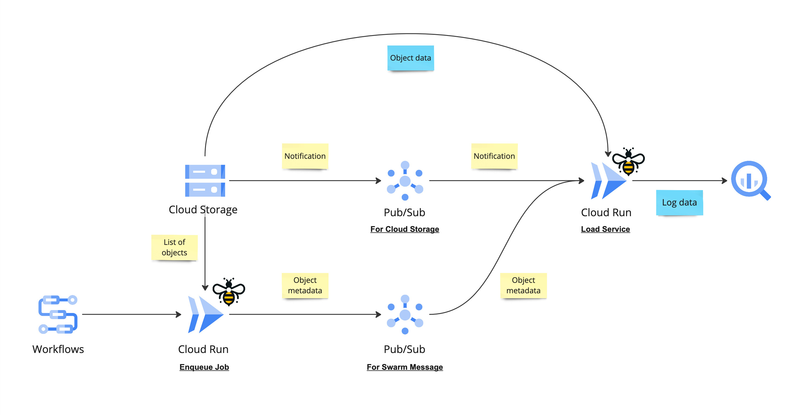

# Deployment

## Overview

Here is a sample architecture for deploying `swarm` to process logs from Cloud Storage and load them into BigQuery. In this setup, we use Cloud Run to run `swarm`, but you can substitute it with any other serverless platform such as Kubernetes, AWS Fargate, or Azure Functions.

In the primary workflow (illustrated in the upper section), `swarm` handles events like the creation of objects in Cloud Storage, triggered via Pub/Sub, and then ingests this data into BigQuery. `swarm` retrieves the object from Cloud Storage, processes it, and then uploads the resulting records into BigQuery. This processing and uploading are governed by rules defined in the Rego language.

In the secondary workflow (depicted in the lower section), `swarm` can be initiated from a Cloud Run job or a local setup. This workflow is designed for collecting a batch of objects from Cloud Storage and placing them into a separate Pub/Sub topic. It's particularly useful for batch processing logs that are housed in Cloud Storage. The use case for this workflow is when you have already stored logs in Cloud Storage and want to ingest them into BigQuery.

## Setup

- [Cloud Storage](https://cloud.google.com/storage/docs/creating-buckets)
- Pub/Sub
  - [Topic](https://cloud.google.com/pubsub/docs/create-topic)
  - [Subscription](https://cloud.google.com/pubsub/docs/create-subscription)
    - From Cloud Storage, push destination must be `/event/pubsub/cs`
    - From swarm (Cloud Run), push destination must be `/event/pubsub/swarm`
- [Cloud Storage notification](https://cloud.google.com/storage/docs/pubsub-notifications)
- [BigQuery](https://cloud.google.com/bigquery/docs/datasets)

